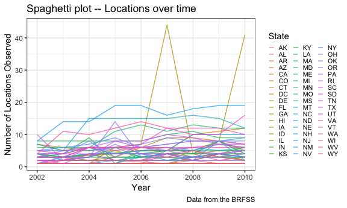

Homework 3
================
Eileen Shea
October 15, 2018

``` r
library(tidyverse)
```

    ## ── Attaching packages ─────────────────────────────────────────── tidyverse 1.2.1 ──

    ## ✔ ggplot2 3.0.0     ✔ purrr   0.2.5
    ## ✔ tibble  1.4.2     ✔ dplyr   0.7.6
    ## ✔ tidyr   0.8.1     ✔ stringr 1.3.1
    ## ✔ readr   1.1.1     ✔ forcats 0.3.0

    ## ── Conflicts ────────────────────────────────────────────── tidyverse_conflicts() ──
    ## ✖ dplyr::filter() masks stats::filter()
    ## ✖ dplyr::lag()    masks stats::lag()

``` r
knitr::opts_chunk$set(
  fig.width = 6,
  fig.asp = .6,
  out.width = "90%"
)

theme_set(theme_bw() + theme(legend.position = "bottom"))
```

## Problem 1

This problem uses the BRFSS data; we will load this data the following
way:

``` r
library(p8105.datasets)
data(brfss_smart2010)
```

Then we need to do the following cleaning steps: 1) format the data to
use appropriate variable names 2) focus on the “Overall Health” topic 3)
include only responses from “Excellent” to “Poor” 4) organize responses
as a factor taking levels ordered from “Excellent” to “Poor”.

``` r
brfss_clean = brfss_smart2010 %>% 
  janitor::clean_names() %>% 
  filter(topic == "Overall Health",
         response == "Poor" | response == "Fair" | response == "Good" | response == "Very good" | response == "Excellent") %>% 
  mutate(response = forcats::fct_relevel(response, c("Excellent", "Very good", "Good", "Fair", "Poor"))) 
```

Next we are interested in the following:

### In 2002, which states were observed at 7 locations?

``` r
brfss_clean %>% 
  filter(year == 2002) %>% 
  group_by(locationabbr) %>% 
  summarize(n_obs = n_distinct(locationdesc)) %>%
  filter(n_obs == 7)
```

    ## # A tibble: 3 x 2
    ##   locationabbr n_obs
    ##   <chr>        <int>
    ## 1 CT               7
    ## 2 FL               7
    ## 3 NC               7

States that were observed at 7 locations in 2002 were CT (Connecticut),
FL (Florida), and NC (North
Carolina).

### Make a “spaghetti plot” that shows the number of locations in each state from 2002 to 2010.

``` r
brfss_clean %>% 
  group_by(locationabbr, year) %>% 
  summarize(n_obs = n_distinct(locationdesc)) %>% 
  ggplot(aes(x = year, y = n_obs, color = locationabbr)) +
  geom_line() +
  labs(
    title = "Spaghetti plot -- Locations over time",
    x = "Year",
    y = "Number of Locations Observed",
    caption = "Data from the BRFSS",
    color = "State"
  ) + 
  theme(legend.position = "right")
```


