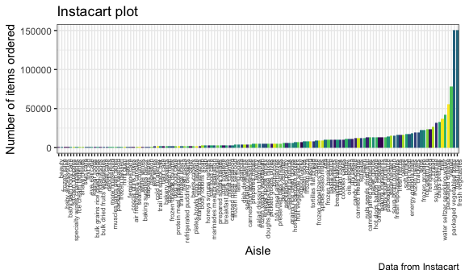
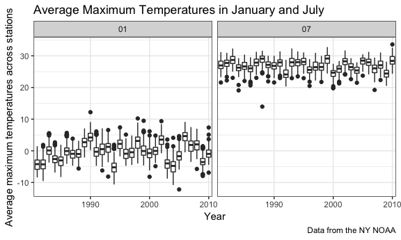

Homework 3
================
Eileen Shea
October 15, 2018

``` r
library(tidyverse)
```

    ## ── Attaching packages ───────────────────────────────────────── tidyverse 1.2.1 ──

    ## ✔ ggplot2 3.0.0     ✔ purrr   0.2.5
    ## ✔ tibble  1.4.2     ✔ dplyr   0.7.6
    ## ✔ tidyr   0.8.1     ✔ stringr 1.3.1
    ## ✔ readr   1.1.1     ✔ forcats 0.3.0

    ## ── Conflicts ──────────────────────────────────────────── tidyverse_conflicts() ──
    ## ✖ dplyr::filter() masks stats::filter()
    ## ✖ dplyr::lag()    masks stats::lag()

``` r
library(ggridges)
```

    ## 
    ## Attaching package: 'ggridges'

    ## The following object is masked from 'package:ggplot2':
    ## 
    ##     scale_discrete_manual

``` r
library(hexbin)
library(patchwork)

knitr::opts_chunk$set(
  fig.width = 6,
  fig.asp = .6,
  out.width = "90%"
)

theme_set(theme_bw() + theme(legend.position = "bottom"))
```

## Problem 1

This problem uses the BRFSS data; we will load this data the following
way:

``` r
library(p8105.datasets)
data(brfss_smart2010)
```

Then we need to do the following cleaning steps: 1) format the data to
use appropriate variable names 2) focus on the “Overall Health” topic 3)
include only responses from “Excellent” to “Poor” 4) organize responses
as a factor taking levels ordered from “Excellent” to “Poor”.

``` r
brfss_clean = brfss_smart2010 %>% 
  janitor::clean_names() %>% 
  filter(topic == "Overall Health",
         response == "Poor" | response == "Fair" | response == "Good" | response == "Very good" | response == "Excellent") %>% 
  mutate(response = forcats::fct_relevel(response, c("Excellent", "Very good", "Good", "Fair", "Poor"))) 
```

Next we are interested in the following:

### In 2002, which states were observed at 7 locations?

``` r
brfss_clean %>% 
  filter(year == 2002) %>% 
  group_by(locationabbr) %>% 
  summarize(n_obs = n_distinct(locationdesc)) %>%
  filter(n_obs == 7)
```

    ## # A tibble: 3 x 2
    ##   locationabbr n_obs
    ##   <chr>        <int>
    ## 1 CT               7
    ## 2 FL               7
    ## 3 NC               7

States that were observed at 7 locations in 2002 were CT (Connecticut),
FL (Florida), and NC (North
Carolina).

### Make a “spaghetti plot” that shows the number of locations in each state from 2002 to 2010.

``` r
brfss_clean %>% 
  group_by(locationabbr, year) %>% 
  summarize(n_obs = n_distinct(locationdesc)) %>% 
  ggplot(aes(x = year, y = n_obs, color = locationabbr)) +
  geom_line(alpha = 0.75) +
  labs(
    title = "Spaghetti plot -- Locations over time",
    x = "Year",
    y = "Number of Locations Observed",
    caption = "Data from the BRFSS",
    color = "State"
  ) + 
  theme(legend.position = "right", legend.text = element_text(size = 8), legend.key.size = unit(0.5,"line"))
```


The “spaghetti plot” shows that most states in most years have fewer
than 10 locations observed. However, there are some notable exceptions -
particularly Florida in the year 2007 which had 44 locations observed;
Florida also had another large spike in locations observed in
2010.

### Make a table showing, for the years 2002, 2006, and 2010, the mean and standard deviation of the proportion of “Excellent” responses across locations in NY State.

``` r
brfss_clean %>% 
  filter(year == 2002 | year == 2006 | year == 2010, locationabbr == "NY", response == "Excellent") %>% 
  group_by(year) %>%
  summarize(mean_excellent_response_ny = mean(data_value),
            sd_excellent_response_ny = sd(data_value)) %>% 
  knitr::kable(digits = 3)
```

| year | mean\_excellent\_response\_ny | sd\_excellent\_response\_ny |
| ---: | ----------------------------: | --------------------------: |
| 2002 |                        24.040 |                       4.486 |
| 2006 |                        22.533 |                       4.001 |
| 2010 |                        22.700 |                       3.567 |

The mean of the proportion of “Excellent” responses across locations in
NY State was highest in 2002, but the proportion of “Excellent”
responses across locations in NY State also had the greatest spread this
year. In both 2006 and 2010, the means for the the proportion of
“Excellent” responses across locations in NY State were relatively
similar.

### For each year and state, compute the average proportion in each response category (taking the average across locations in a state). Make a five-panel plot that shows, for each response category separately, the distribution of these state-level averages over time.

``` r
brfss_clean %>% 
  group_by(year, locationabbr, response) %>%
  summarize(average_prop = mean(data_value, na.rm = TRUE)) %>%
  ggplot(aes(x = year, y = average_prop, color = locationabbr)) +
  geom_line(alpha = 0.5) +
  facet_grid(~response) + 
  scale_x_continuous(breaks = c(2002, 2006, 2010),
                     labels = c("'02", "'06", "'10")) +
  labs(
    title = "Response panels: state-level averages over time",
    x = "Year (2000s)",
    y = "Average proportion of response",
    caption = "Data from the BRFSS",
    color = "State"
  ) +
   theme(legend.position = "right", legend.text = element_text(size = 8), legend.key.size = unit(0.5,"line"))
```


This plot shows that the average proportion of a given response across
time is loosely similar across states. This conclusion is reached
because we see that the lines for each state over time are generally
clustered together in a single response panel. For example, all states
had an average proportion of “Poor” responses of less than 10% during
any given year. Additionally, all states had an average proportion of
“Very good” responses somewhere between 25% and 45% at any given time.

## Problem 2

This problem uses the Instacart data; we can once again load this
dataset with the p8105.datasets package:

``` r
data(instacart)
```

This datast consists of 1384617 observations and 15 variables. Key
variables include *order\_id* which is an order indentifier,
*order\_hour\_of\_day* which tells us the hour of the day that the order
was placed, *product\_name* which tells us the name of the product,
*aisle* which tells us the aisle category of the given product, and
*department* which tells us the department category of the given
product. In this dataset, an observation is a distinct product from a
unique order, which is found in an individual row. For example, Row 1
tells us that in Order 1 Bulgarian Yogurt was bought from the yogurt
aisle, while Row 6 tells us that in Order 1 a Bag of Organic Bananas was
bought from the produce department.

Now we are interested in the
following:

### How many aisles are there, and which aisles are the most items ordered from?

``` r
instacart %>% 
  count(aisle) %>% 
  arrange(desc(n)) %>% 
  filter(n > 70000) %>% 
  knitr::kable()
```

| aisle                      |      n |
| :------------------------- | -----: |
| fresh vegetables           | 150609 |
| fresh fruits               | 150473 |
| packaged vegetables fruits |  78493 |

There are **134** aisles. The aisles with the most items ordered are the
“fresh vegetables” aisle and the “fresh fruits” aisle; the “packaged
vegetables fruits” aisle is the next most popular aisle, but this aisle
is not nearly as popular as the fresh produce
aisles.

### Make a plot that shows the number of items ordered in each aisle. Order aisles sensibly, and organize your plot so others can read it.

``` r
instacart %>% 
  group_by(aisle) %>% 
  summarize(count = n()) %>% 
  ggplot(aes(x = reorder(aisle, count), y = count, fill = aisle)) +
  geom_bar(stat = "identity") +
  labs(
    title = "Instacart plot",
    x = "Aisle",
    y = "Number of items ordered",
    caption = "Data from Instacart"
  ) +
  viridis::scale_fill_viridis(
    discrete = TRUE
  ) +
  theme(legend.position = "none", axis.text.x = element_text(angle = 90, hjust = 1, size = 6))
```



Most of the 134 aisles in the Instacart dataset have fewer than 50000
items ordered from them, with the exception of the aisles in the table
above. This fact makes the plot of number of items ordered in each aisle
arranged in ascending order very left
skewed.

### Make a table showing the most popular item in each of the aisles “baking ingredients”, “dog food care”, and “packaged vegetables fruits”.

``` r
instacart %>% 
  filter(aisle == "baking ingredients" | aisle == "dog food care" | aisle == "packaged vegetables fruits") %>% 
  group_by(aisle, product_name) %>% 
  summarize(n = n()) %>% 
  group_by(aisle) %>% 
  filter(n == max(n)) %>% 
  knitr::kable()
```

| aisle                      | product\_name                                 |    n |
| :------------------------- | :-------------------------------------------- | ---: |
| baking ingredients         | Light Brown Sugar                             |  499 |
| dog food care              | Snack Sticks Chicken & Rice Recipe Dog Treats |   30 |
| packaged vegetables fruits | Organic Baby Spinach                          | 9784 |

The most popular item in the “baking ingredients” aisle is Light Brown
Sugar at 499 purchases; the most popular item in the “dog food care”
aisle is Snack Sticks Chicken & Rice Recipe Dog Treats at 30 purchases;
the most popular item in the “packaged vegetables fruits” aisle is
Organic Baby Spinach at 9784 purchases. We would expect the “packaged
vegetables fruits” to have the most popular item out of all of these
aisles’ most popular items since the previous bar graph and table show
that “packaged vegetables fruits” is one of the most bought from
aisles.

### Make a table showing the mean hour of the day at which Pink Lady Apples and Coffee Ice Cream are ordered on each day of the week; format this table for human readers (i.e. produce a 2 x 7 table)

``` r
instacart %>% 
  filter(product_name == "Pink Lady Apples" | product_name == "Coffee Ice Cream") %>% 
  group_by(product_name, order_dow) %>% 
  summarize(mean_hour_of_day_ordered = mean(order_hour_of_day)) %>% 
  spread(key = order_dow, value = mean_hour_of_day_ordered) %>% 
  knitr::kable()
```

| product\_name    |        0 |        1 |        2 |        3 |        4 |        5 |        6 |
| :--------------- | -------: | -------: | -------: | -------: | -------: | -------: | -------: |
| Coffee Ice Cream | 13.77419 | 14.31579 | 15.38095 | 15.31818 | 15.21739 | 12.26316 | 13.83333 |
| Pink Lady Apples | 13.44118 | 11.36000 | 11.70213 | 14.25000 | 11.55172 | 12.78431 | 11.93750 |

With the exception of Day 0 (Sunday) and Day 5 (Friday) when Pink Lady
Apples and Coffee Ice Cream are bought around the same time of day, Pink
Lady Apples are generally bought earlier in the day than Coffee Ice
Cream is.

### Problem 3

This problem uses the NY NOAA data; we can once again load this dataset
with the p8105.datasets package:

``` r
data(ny_noaa)
```

This datast consists of 2595176 observations and 7 variables collected
from NY weather stations over the time period of January 1, 1981 to
December 31, 2010. Key variables include *id* which is a weather station
identifier, *date* which tells us the date of the observation, *prcp*
which tells us the amount of precipitation in tenths of mm, and
*tmax*/*tmin* which tell us the maximim/minimum temperatures in tenths
of degrees Celsius. Each weather station may collect only a subset of
these variables, and therefore the resulting dataset contains extensive
missing data.

Now we are interested in the
following:

### Do some data cleaning. Create separate variables for year, month, and day. Ensure observations for temperature, precipitation, and snowfall are given in reasonable units. For snowfall, what are the most commonly observed values? Why?

``` r
ny_noaa_clean = ny_noaa %>% 
  separate(date, into = c("year", "month", "day"), sep = "-") %>% 
  filter(snow >= 0) %>% 
  mutate(
    tmax = as.numeric(tmax) / 10,
    tmin = as.numeric(tmin) / 10,
    prcp = prcp / 10
  )

ny_noaa_clean %>% 
  group_by(snow) %>% 
  summarize(n = n()) %>% 
  arrange(desc(n))
```

    ## # A tibble: 280 x 2
    ##     snow       n
    ##    <int>   <int>
    ##  1     0 2008508
    ##  2    25   31022
    ##  3    13   23095
    ##  4    51   18274
    ##  5    76   10173
    ##  6     8    9962
    ##  7     5    9748
    ##  8    38    9197
    ##  9     3    8790
    ## 10   102    6552
    ## # ... with 270 more rows

This cleaning step created separate variable for year, month, and day.
It also converted unreasonable units (i.e. tenths of mm, tenths of
degrees C) to more reasonable units (i.e. mm, degrees C) and filtered
out an unreasonable negative observation for snowfall. The most commonly
observed values for snowfall are zero because most days of the year it
does not
snow.

### Make a two-panel plot showing the average max temperature in January and in July in each station across years. Is there any observable / interpretable structure? Any outliers?

``` r
ny_noaa_clean %>% 
  filter(month == "01" | month == "07") %>% 
  group_by(year, month, id) %>% 
  summarize(avg_tmax = mean(tmax, na.rm = TRUE)) %>%
  ggplot(aes(x = year, y = avg_tmax)) +
  geom_boxplot() +
  facet_grid(~month) +
  scale_x_discrete(breaks = c(1980, 1990, 2000, 2010)) +
  labs(
    title = "Average Maximum Temperatures in January and July",
    x = "Year",
    y = "Average maximum temperatures across stations",
    caption = "Data from the NY NOAA"
  ) 
```

    ## Warning: Removed 5313 rows containing non-finite values (stat_boxplot).



There is not much of an observable structure to this plot, other than
the fact that the average maximum temperature in January is roughly
clustered around 0 degrees Celsius over time while the average maximum
temperature in July is roughly clustered around 27 degrees Celsius over
time. There are some observable outliers, such as the station that
observed a January average maximum temperature greater than 10 degrees
Celsius in
1990.

### Make a two-panel plot showing (i) tmax vs tmin for the full dataset (note that a scatterplot may not be the best option); and (ii) make a plot showing the distribution of snowfall values greater than 0 and less than 100 separately by year.

``` r
tmax_tmin_p = ny_noaa_clean %>% 
  ggplot(aes(x = tmax, y = tmin)) +
  geom_hex() +
  theme(legend.key.width = unit(1.25,"cm"))

snowfall_p = ny_noaa_clean %>% 
  filter(snow > 0 & snow < 100) %>% 
  ggplot(aes(x = snow, y = year, fill = year)) +
  geom_density_ridges(alpha = 0.25) +
  viridis::scale_fill_viridis(
    discrete = TRUE
  ) +
  theme(legend.position = "none")

(tmax_tmin_p + snowfall_p)
```

    ## Warning: Removed 927387 rows containing non-finite values (stat_binhex).

    ## Picking joint bandwidth of 3.76


