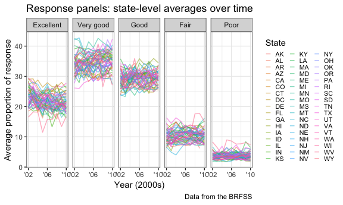

Homework 3
================
Eileen Shea
October 15, 2018

``` r
library(tidyverse)
```

    ## ── Attaching packages ─────────────────────────────────────────── tidyverse 1.2.1 ──

    ## ✔ ggplot2 3.0.0     ✔ purrr   0.2.5
    ## ✔ tibble  1.4.2     ✔ dplyr   0.7.6
    ## ✔ tidyr   0.8.1     ✔ stringr 1.3.1
    ## ✔ readr   1.1.1     ✔ forcats 0.3.0

    ## ── Conflicts ────────────────────────────────────────────── tidyverse_conflicts() ──
    ## ✖ dplyr::filter() masks stats::filter()
    ## ✖ dplyr::lag()    masks stats::lag()

``` r
library(ggridges)
```

    ## 
    ## Attaching package: 'ggridges'

    ## The following object is masked from 'package:ggplot2':
    ## 
    ##     scale_discrete_manual

``` r
knitr::opts_chunk$set(
  fig.width = 6,
  fig.asp = .6,
  out.width = "90%"
)

theme_set(theme_bw() + theme(legend.position = "bottom"))
```

## Problem 1

This problem uses the BRFSS data; we will load this data the following
way:

``` r
library(p8105.datasets)
data(brfss_smart2010)
```

Then we need to do the following cleaning steps: 1) format the data to
use appropriate variable names 2) focus on the “Overall Health” topic 3)
include only responses from “Excellent” to “Poor” 4) organize responses
as a factor taking levels ordered from “Excellent” to “Poor”.

``` r
brfss_clean = brfss_smart2010 %>% 
  janitor::clean_names() %>% 
  filter(topic == "Overall Health",
         response == "Poor" | response == "Fair" | response == "Good" | response == "Very good" | response == "Excellent") %>% 
  mutate(response = forcats::fct_relevel(response, c("Excellent", "Very good", "Good", "Fair", "Poor"))) 
```

Next we are interested in the following:

### In 2002, which states were observed at 7 locations?

``` r
brfss_clean %>% 
  filter(year == 2002) %>% 
  group_by(locationabbr) %>% 
  summarize(n_obs = n_distinct(locationdesc)) %>%
  filter(n_obs == 7)
```

    ## # A tibble: 3 x 2
    ##   locationabbr n_obs
    ##   <chr>        <int>
    ## 1 CT               7
    ## 2 FL               7
    ## 3 NC               7

States that were observed at 7 locations in 2002 were CT (Connecticut),
FL (Florida), and NC (North
Carolina).

### Make a “spaghetti plot” that shows the number of locations in each state from 2002 to 2010.

``` r
brfss_clean %>% 
  group_by(locationabbr, year) %>% 
  summarize(n_obs = n_distinct(locationdesc)) %>% 
  ggplot(aes(x = year, y = n_obs, color = locationabbr)) +
  geom_line(alpha = 0.75) +
  labs(
    title = "Spaghetti plot -- Locations over time",
    x = "Year",
    y = "Number of Locations Observed",
    caption = "Data from the BRFSS",
    color = "State"
  ) + 
  theme(legend.position = "right")
```


The “spaghetti plot” shows that most states in most years have fewer
than 10 locations observed. However, there are some notable exceptions -
particularly Florida in the year 2007 which had 44 locations observed;
Florida also had another large spike in locations observed in
2010.

### Make a table showing, for the years 2002, 2006, and 2010, the mean and standard deviation of the proportion of “Excellent” responses across locations in NY State.

``` r
brfss_clean %>% 
  filter(year == 2002 | year == 2006 | year == 2010, locationabbr == "NY", response == "Excellent") %>% 
  group_by(year) %>%
  summarize(mean_excellent_response_ny = mean(data_value),
            sd_excellent_response_ny = sd(data_value)) %>% 
  knitr::kable(digits = 3)
```

| year | mean\_excellent\_response\_ny | sd\_excellent\_response\_ny |
| ---: | ----------------------------: | --------------------------: |
| 2002 |                        24.040 |                       4.486 |
| 2006 |                        22.533 |                       4.001 |
| 2010 |                        22.700 |                       3.567 |

The mean of the proportion of “Excellent” responses across locations in
NY State was highest in 2002, but the proportion of “Excellent”
responses across locations in NY State also had the greatest spread this
year. In both 2006 and 2010, the means for the the proportion of
“Excellent” responses across locations in NY State were relatively
similar.

### For each year and state, compute the average proportion in each response category (taking the average across locations in a state). Make a five-panel plot that shows, for each response category separately, the distribution of these state-level averages over time.

``` r
brfss_clean %>% 
  group_by(year, locationabbr, response) %>%
  summarize(average_prop = mean(data_value, na.rm = TRUE)) %>%
  ggplot(aes(x = year, y = average_prop, color = locationabbr)) +
  geom_line(alpha = 0.5) +
  facet_grid(~response) + 
  scale_x_continuous(breaks = c(2002, 2006, 2010),
                     labels = c("'02", "'06", "'10")) +
  labs(
    title = "Response panels: state-level averages over time",
    x = "Year (2000s)",
    y = "Average proportion of response",
    caption = "Data from the BRFSS",
    color = ""
  ) +
  theme(legend.position = "right")
```



This plot shows that the average proportion of a given response across
time is loosely similar across states. This conclusion is reached
because we see that the lines for each state over time are generally
clustered together in a single response panel. For example, all states
had an average proportion of “Poor” responses of less than 10% during
any given year. Additionally, all states had an average proportion of
“Very good” responses somewhere between 25% and 45% at any given time.

## Problem 2

This problem uses the Instacart data; we can once again load this
p8105.datasets package:

``` r
data(instacart)
```
